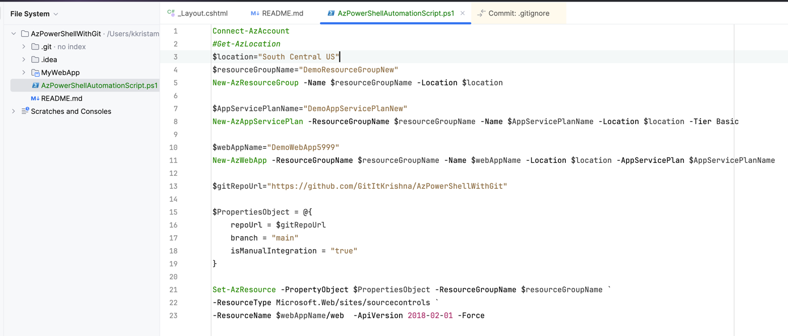
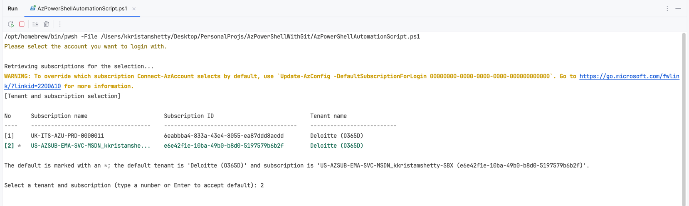
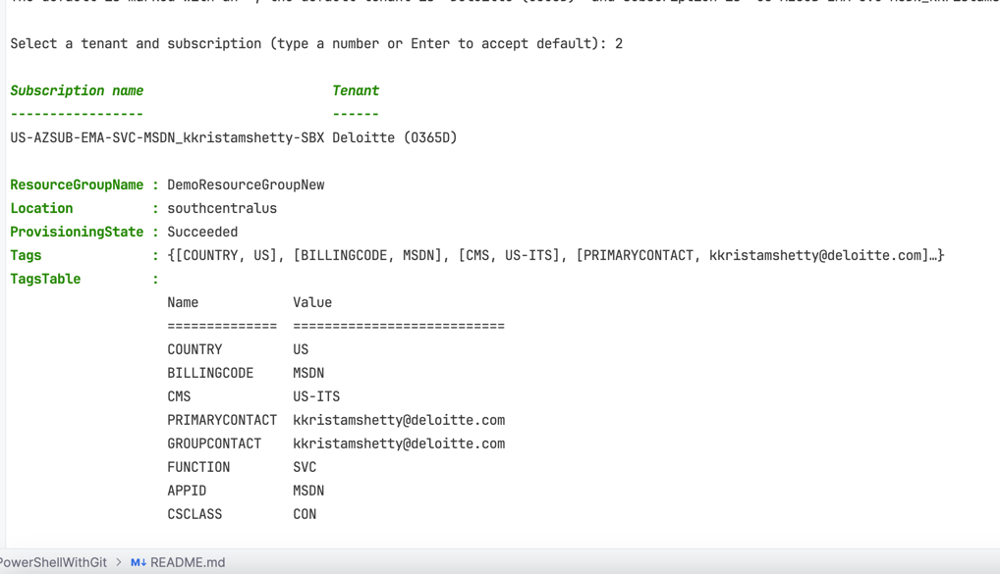
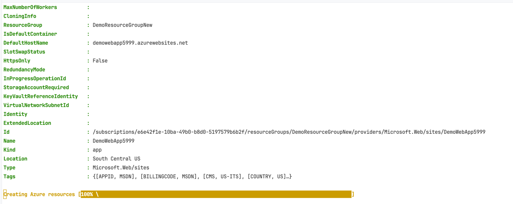
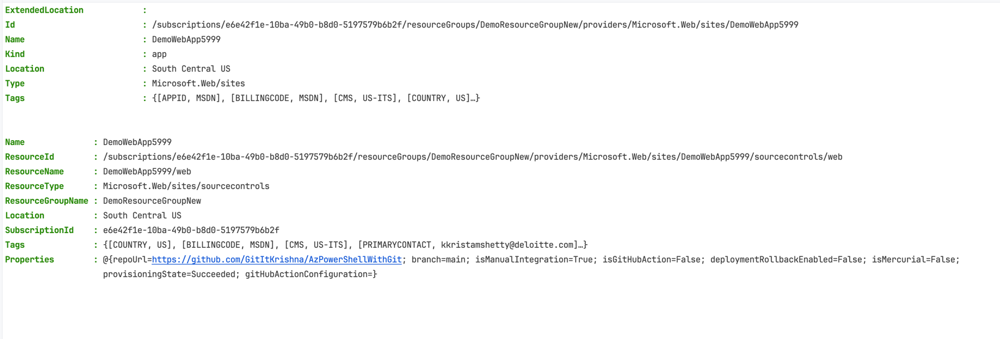
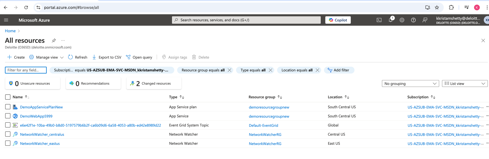
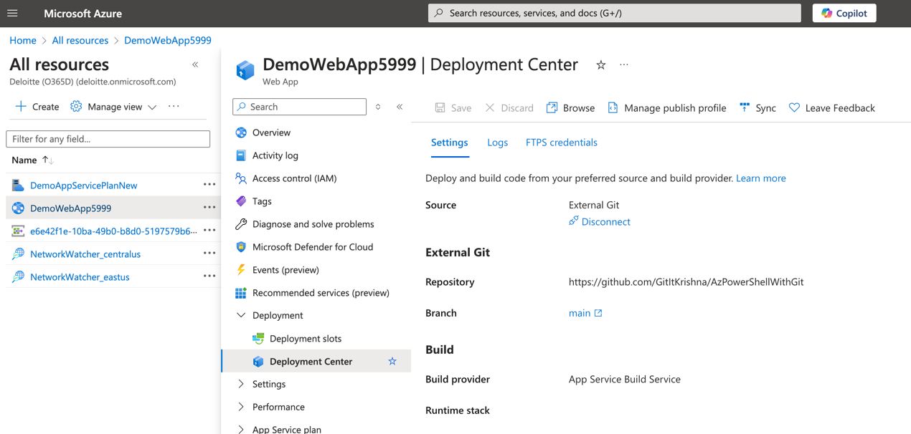
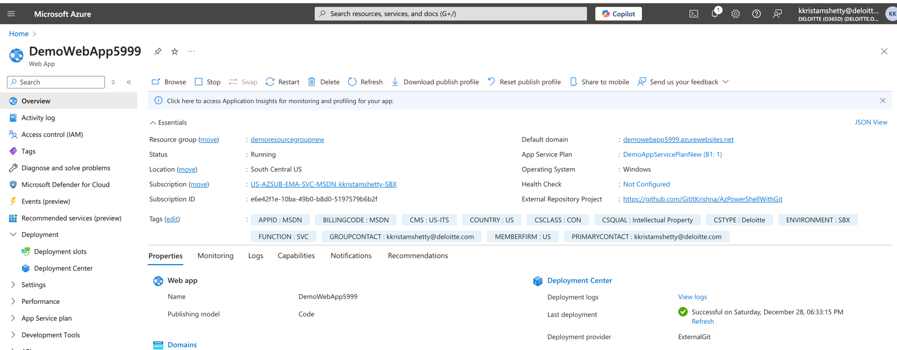
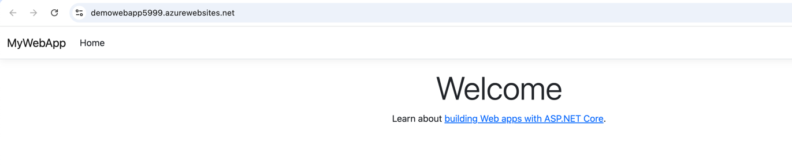

**A repo to create a webapp using powershell commands and github integration**

Please refer to the below screenshot for the powershell commands to create a web app.



## Steps to Create a Webapp using powershell commands and github integration
1. Create a new repository in github
2. Clone the repository to your local machine
3. Create a new folder in the cloned repository
4. Test your local sample project by running it and see if it works
5. Create a new powershell script file in the root of the repository
6. Add the following code to the powershell script file
```powershell
Connect-AzAccount
$location="South Central US"
$resourceGroupName="DemoResourceGroupNew"
New-AzResourceGroup -Name $resourceGroupName -Location $location

$AppServicePlanName="DemoAppServicePlanNew"
New-AzAppServicePlan -ResourceGroupName $resourceGroupName -Name $AppServicePlanName -Location $location -Tier Basic

$webAppName="DemoWebApp5999"
New-AzWebApp -ResourceGroupName $resourceGroupName -Name $webAppName -Location $location -AppServicePlan $AppServicePlanName

$gitRepoUrl="https://github.com/GitItKrishna/AzPowerShellWithGit"

$PropertiesObject = @{
    repoUrl = $gitRepoUrl
    branch = "main"
    isManualIntegration = "true"
}

Set-AzResource -PropertyObject $PropertiesObject -ResourceGroupName $resourceGroupName `
-ResourceType Microsoft.Web/sites/sourcecontrols `
-ResourceName $webAppName/web  -ApiVersion 2018-02-01 -Force
```
7. the details of the above powershell script is as shown below.
```aiignore
1. Connect to Azure Account:  
Connect-AzAccount
This command prompts you to log in to your Azure account.  

2. Set Variables:  
$location="South Central US"
$resourceGroupName="DemoResourceGroupNew"
These variables store the location and resource group name for the Azure resources.  

3. Create Resource Group:  
New-AzResourceGroup -Name $resourceGroupName -Location $location
This command creates a new resource group in the specified location.  

4. Create App Service Plan:  
$AppServicePlanName="DemoAppServicePlanNew"
New-AzAppServicePlan -ResourceGroupName $resourceGroupName -Name $AppServicePlanName -Location $location -Tier Basic
This command creates a new App Service Plan within the resource group.  

5. Create Web App:  
$webAppName="DemoWebApp5999"
New-AzWebApp -ResourceGroupName $resourceGroupName -Name $webAppName -Location $location -AppServicePlan $AppServicePlanName
This command creates a new Web App within the App Service Plan.  

6. Set GitHub Repository URL:  
$gitRepoUrl="https://github.com/GitItKrishna/AzPowerShellWithGit"
This variable stores the URL of the GitHub repository to be integrated with the Web App.  
Configure Source Control:  
$PropertiesObject = @{
    repoUrl = $gitRepoUrl
    branch = "main"
    isManualIntegration = "true"
}

Set-AzResource -PropertyObject $PropertiesObject -ResourceGroupName $resourceGroupName `
-ResourceType Microsoft.Web/sites/sourcecontrols `
-ResourceName $webAppName/web  -ApiVersion 2018-02-01 -Force

This block of code sets the source control configuration for the Web App, linking it to the specified GitHub repository and branch. The Set-AzResource command applies these settings to the Web App.
```
8. Run the powershell script file in the powershell terminal
You can see the output as shown below. After you are logged in successfully, you are asked to choose the subscription as i have multiple subscriptions on my azure account.

9. I have selected the subscription as 2  and you can see the resources are created in a sequential order.




10. After running the above script, switch to azure portal and click on All Resources to see all the resources created .
11. You can observe resource group, app service plan and web app created as shown below.

12. Also, select the web app and click on deployment center to see the github integration.


13. Select the webapp and select the default domain and copy the url.


14. Paste the url in the browser and you can see the webapp created.


